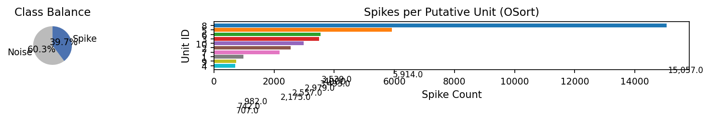
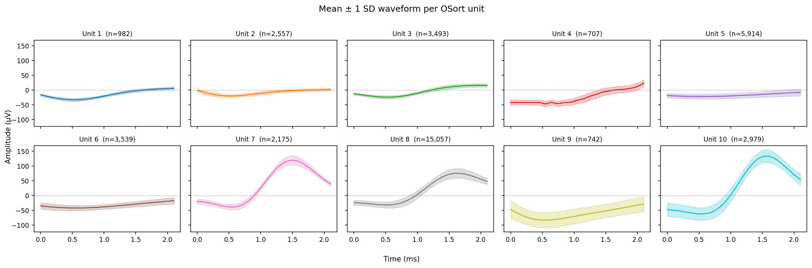
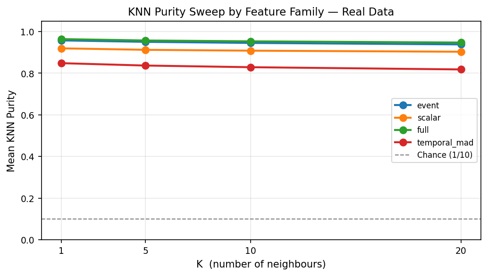
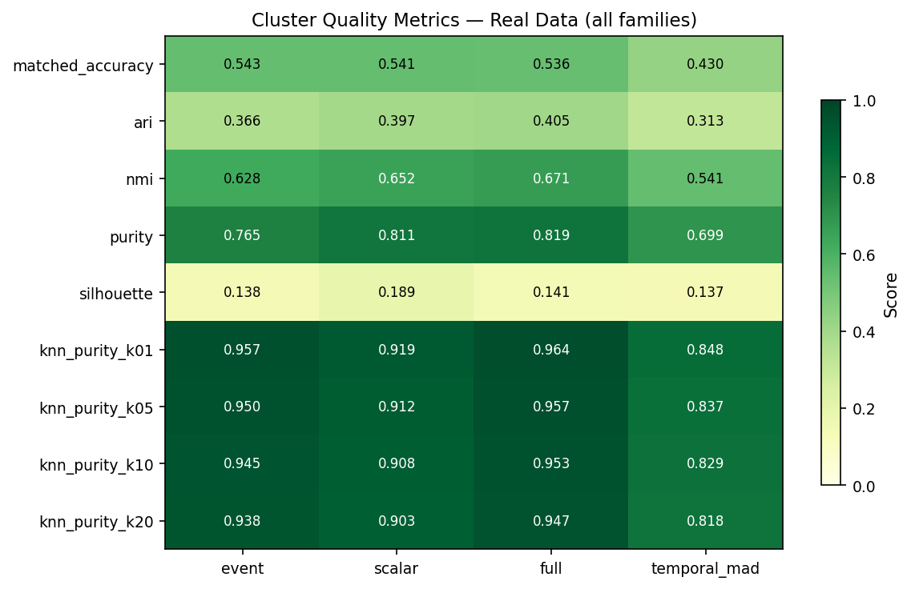
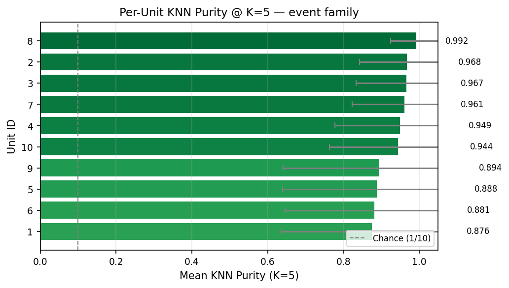
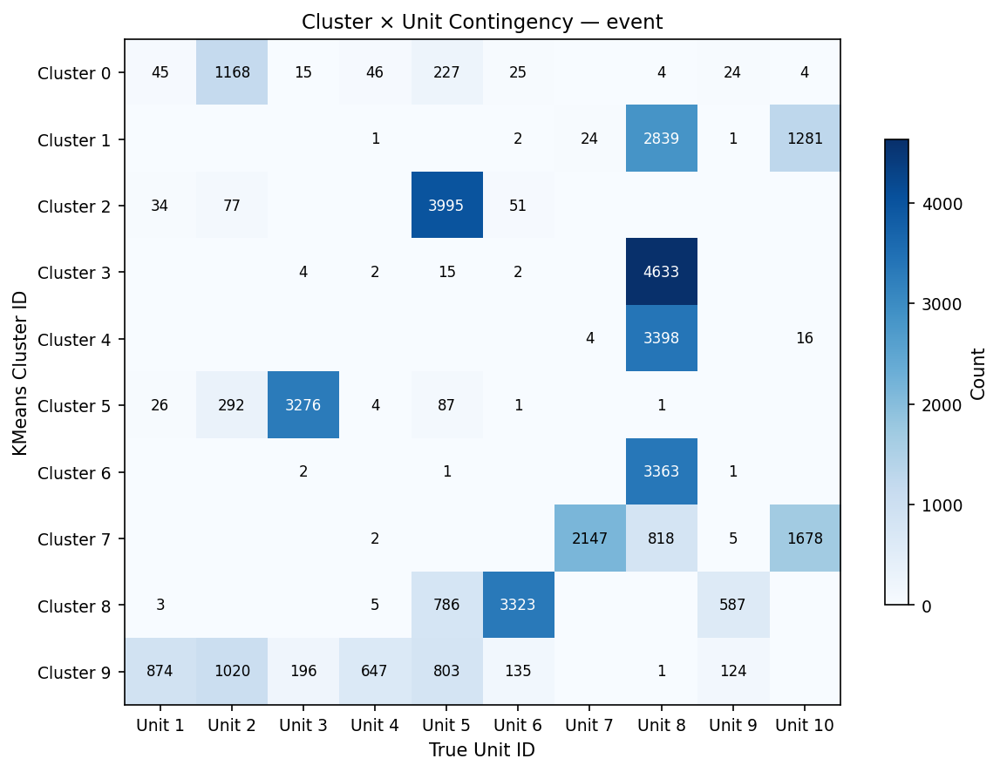

# Afferent Clustering Results — Real Units

**Date:** 2026-04-07 07:57
**Dataset:** `data/real_units/waveforms_real.npz` — 96,006 total snippets
**Spike events used for clustering:** 38,145
**Putative units (OSort):** 10
**Feature tier:** 3 (scalar + temporal MAD + event-based)
**WeightBank config:** n_bins=10, sigma_scale=1.0, threshold=0.5
**Clustering:** KMeans (n_clusters=10, n_init=10, seed=42)
**Results directory:** `/Users/marco/Cursor_Folder/Cursor_Codespace/spike_discrim/data/results/20260407_075152`

---

## Metric Definitions

| Metric | Description |
|--------|-------------|
| **Matched Accuracy** | Best cluster↔unit assignment via Hungarian algorithm |
| **ARI** | Adjusted Rand Index (chance-corrected) |
| **NMI** | Normalised Mutual Information |
| **Purity** | Fraction of each cluster belonging to dominant unit |
| **Silhouette** | Mean silhouette coefficient of KMeans clusters |
| **KNN Purity (K=k)** | For each spike, fraction of k nearest neighbours in afferent space sharing the same unit label |

---

## Family-Level Results

| Rank | Family | Dims | Matched Acc | ARI | NMI | Purity | Silhouette | KNN-k1 | KNN-k5 | KNN-k10 | KNN-k20 |
|------|--------|------|-------------|-----|-----|--------|------------|--------|--------|---------|---------|
| 1 | event | 120 | 0.5426 | 0.3665 | 0.6275 | 0.7645 | 0.1376 | 0.9575 | 0.9504 | 0.9453 | 0.9382 |
| 2 | scalar | 60 | 0.5406 | 0.3974 | 0.6518 | 0.8108 | 0.1888 | 0.9194 | 0.9123 | 0.9082 | 0.9031 |
| 3 | full | 260 | 0.5365 | 0.4046 | 0.6708 | 0.8190 | 0.1407 | 0.9638 | 0.9572 | 0.9531 | 0.9472 |
| 4 | temporal_mad | 80 | 0.4301 | 0.3125 | 0.5407 | 0.6991 | 0.1373 | 0.8482 | 0.8367 | 0.8288 | 0.8181 |

---

## Per-Unit KNN Purity (Best Family: `event`)

| Unit ID | Spikes | Mean Purity (K=5) | Std | Min |
|---------|--------|-------------------|-----|-----|
| 1 | 982 | 0.8760 | 0.2396 | 0.0000 |
| 2 | 2,557 | 0.9679 | 0.1256 | 0.0000 |
| 3 | 3,493 | 0.9666 | 0.1333 | 0.0000 |
| 4 | 707 | 0.9494 | 0.1711 | 0.0000 |
| 5 | 5,914 | 0.8878 | 0.2478 | 0.0000 |
| 6 | 3,539 | 0.8813 | 0.2351 | 0.0000 |
| 7 | 2,175 | 0.9613 | 0.1384 | 0.0000 |
| 8 | 15,057 | 0.9920 | 0.0674 | 0.0000 |
| 9 | 742 | 0.8943 | 0.2527 | 0.0000 |
| 10 | 2,979 | 0.9440 | 0.1807 | 0.0000 |

---

## Figures

| Figure | Description |
|--------|-------------|
|  | Class balance and per-unit spike counts |
|  | Mean ± 1 SD waveform per OSort unit |
|  | KNN purity vs K for each feature family |
|  | All metrics × families heatmap |
|  | Per-unit KNN purity at K=5 |
|  | KMeans cluster vs true unit contingency |

---

## Interpretation

- **KNN purity** directly measures whether the afferent population-code
  representation preserves unit identity in its local neighbourhood structure.
  A purity of *p* at K=5 means that, on average, 5×*p* of a spike's
  5 nearest neighbours in activation space belong to the same neuron.

- Values **well above chance (1/10 = 0.100)** indicate
  that the afferent encoding creates a geometry where same-unit spikes are
  clustered together — a prerequisite for any downstream competitive-learning
  or WTA spiking layer.

- The **per-unit breakdown** reveals which neurons are hardest to separate,
  guiding future work on feature engineering or per-channel normalisation.
